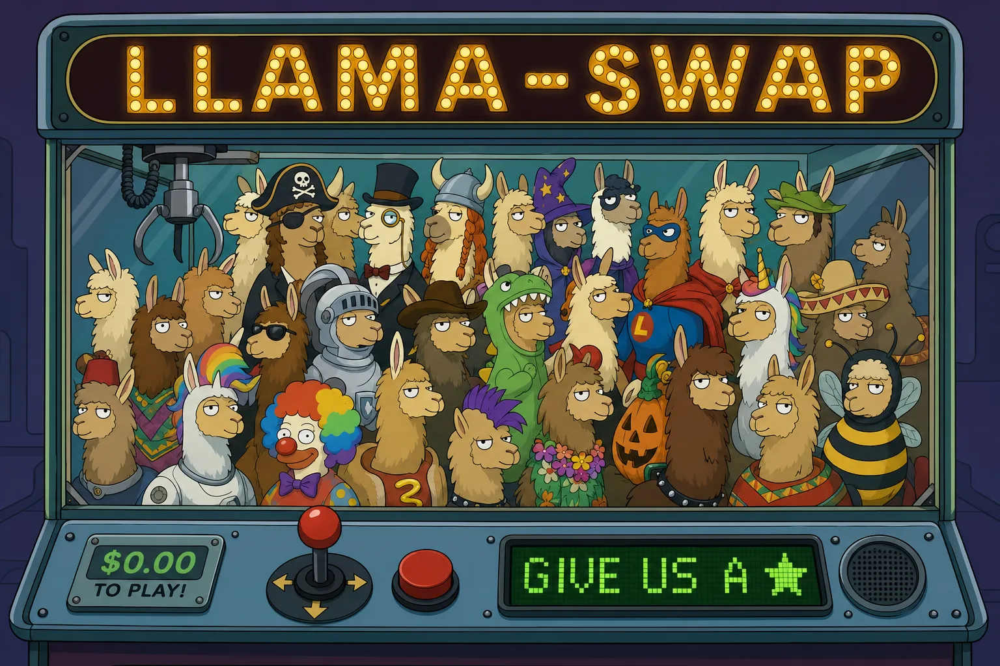

# llama-swap (macos-extended fork)

> A fork of [mostlygeek/llama-swap](https://github.com/mostlygeek/llama-swap) that adds a native **menu-bar / system-tray companion** for macOS, Windows and Linux. All credit for llama-swap itself belongs to the upstream project; this fork layers the desktop helper (and a few quality-of-life proxy tweaks) on top.

Run multiple generative AI models on your machine and hot-swap between them on demand. llama-swap works with any OpenAI and Anthropic API compatible server.

Built in Go for performance and simplicity, llama-swap has zero dependencies and is incredibly easy to set up. Get started in minutes - just one binary and one configuration file.

## What this fork adds

A native menu-bar (macOS) / system-tray (Windows, Linux) helper that is **on by default** - start llama-swap and the icon appears next to your clock:

- **Live load bars** in the icon - two configurable bars showing any of: GPU utilization, VRAM, CPU, RAM.
- **Current model at a glance** - the active model's name is shown next to the icon (macOS/Linux) and in the tooltip.
- **Click to switch models** - the menu lists every configured model; clicking one loads it. "Unload All" frees your GPU.
- **Request counters** - completed and waiting request counts, straight from the proxy.

Configure which bars are shown in your regular llama-swap `config.yaml`:

```yaml
menu_bar:
  enabled: true        # default: true (set `menu_bar: false` to opt out)
  bars: [gpu, vram]    # 1-2 of: gpu, vram, cpu, ram (top bar first)
```

GPU stats come from llama-swap's built-in performance monitor (macOS: native; Linux: LACT, nvidia-smi, rocm-smi or sysfs; Windows: nvidia-smi).

## Tiered entry points

By default every request lands on the same `-listen` port and is served
first-in-first-out. When several kinds of consumers share one llama-swap
backend — say, a paid API-backed session that must never sit behind a
long-running local job's prompt-cache invalidate window — you can give each
consumer class its own **entry point** into the queue.

**A tier is not a separate queue.** The queue stays one uniform whole (a
single FIFO scheduler). A tier is an *extra HTTP listener* (its own port)
that tags every request arriving through it with a rank before it joins the
shared queue. Hierarchy is pre-determined architecturally by which port a
consumer is pointed at — the main `-listen` port is always the implicit
**default tier** (rank 0) and needs no configuration; you only declare the
extra ports:

```yaml
tiers:
  priority:
    listen: "127.0.0.1:8002"
    rank: 10
    preempts: true       # boots ANY running lower-rank request
  background:
    listen: "127.0.0.1:8003"
    rank: -10
    preemptible: true    # may be booted by ANY higher-rank arrival
```

Per-tier keys: `listen` (required, own address), `rank` (required int; the
default tier is rank 0 — negative ranks are fine for a "run only when
everything else is idle" background tier), `preempts` (bool, default false),
`preemptible` (bool, default false).

**No `tiers:` block = single-listener behavior, byte-for-byte identical to
before this feature existed.** There is no rubber-stamp default-tier
boilerplate to write.

Semantics:

1. **Queue order** — rank DESC, then the existing per-model
   `routing.scheduler.settings.fifo.priority`, then arrival order.
2. **Rank barrier** — a queued request is never granted while a strictly
   higher-rank request is still queued, so a background tier only runs once
   the priority + default queues are empty.
3. **Preemption rule** — an arrival A that cannot be granted because of
   in-flight work boots a running request B iff
   `rank(B) < rank(A) AND (B.preemptible OR A.preempts)`. Preemption never
   crosses equal ranks, and never touches a non-preemptible victim unless the
   arrival itself has `preempts: true`.
4. **"Booted back into the queue" (v1 mechanics)** — server-side cancel of
   the victim's proxied upstream request, then a `503` with
   `X-LlamaSwap-Preempted: 1` + `Retry-After: 1` (best effort: if the victim
   had already started streaming bytes, the stream is simply aborted). A
   well-behaved client just retries, re-entering the queue through its own
   tier's port.
5. The extra listeners are started once at boot from the loaded config and
   are **not** reconciled by `-watch-config` / SIGHUP reload — adding,
   removing, or moving a tier port requires a restart.

A full example, including a Claude Code CLI stub for pointing a session at
the priority (or background) tier instead of the default port, lives in
[`examples/tiers.example.yaml`](examples/tiers.example.yaml).

## Contributing: run the preflight before you commit

`scripts/preflight.sh` runs locally what GitHub Actions runs remotely. Install it as a pre-commit hook once per clone:

```bash
bash scripts/install-githooks.sh
```

It exists because local verification and CI were running different commands. `make test-all` — what both the Linux and Windows lanes run — is `go test -race`, and a plain `go test ./internal/...` passes on code that CI fails: a data race in a test is invisible without `-race`. A commit verified that way went red on both lanes on 2026-07-27, and the lane had already been red for five days for the same reason.

The preflight mirrors each workflow in `.github/workflows/` and applies the same `paths:` scoping to your changed files, so a docs-only commit costs nothing while a Go change runs the full race suite:

| Lane | Mirrors | Runs |
|---|---|---|
| gofmt | `go-ci.yml` | `gofmt -l .` must be empty |
| build + vet | (fails faster than the suite) | `go build ./...`, `go vet ./internal/...` |
| race suite | `go-ci.yml`, `go-ci-windows.yml` | `make test-all` |
| config schema | `config-schema.yml` | `TestConfig_ExampleMatchesSchema` |
| tray + menubar | `tray-ci.yml` | package tests + linux/amd64, linux/arm64, windows/amd64 cross-builds |
| Swift helper | `tray-ci.yml` (macOS job) | `swift build -c release` + `swift test` |
| UI | `ui-tests.yml` | `make test-ui` |

Run it by hand any time:

```bash
scripts/preflight.sh          # scope to changed files
scripts/preflight.sh --all    # every lane
scripts/preflight.sh --quick  # skip the slow -race suite (does NOT predict CI)
```

**Bypassing is a maintainer decision, not an automated one.** The escape hatches exist for a human who knows why a given commit is safe; an agent or script must fix the failure instead, never route around it:

```bash
LLAMA_SWAP_PREFLIGHT=quick git commit ...   # skip only the -race suite
LLAMA_SWAP_PREFLIGHT=skip  git commit ...   # skip the preflight entirely
```

Two limits worth knowing: it tests the **working tree**, not the staged index (it warns when a file is staged and then further modified), and the Windows-native half of CI cannot run on a non-Windows box — though every failure seen so far reproduced under `-race` on any platform.

## Installation

Each installer downloads the llama-swap binary plus the helper for your platform, and writes a starter config if you don't have one. No package manager, no dependencies.

### macOS (Apple Silicon)

```shell
curl -fsSL https://raw.githubusercontent.com/pcvelz/llama-swap-macos-extended/main/scripts/install-macos.sh | bash
```

Installs `llama-swap` and the native `llama-swap-menu` menu-bar app into `~/bin` and clears the quarantine flag.

### Linux

```shell
curl -fsSL https://raw.githubusercontent.com/pcvelz/llama-swap-macos-extended/main/scripts/install-linux.sh | bash
```

Installs `llama-swap` and `llama-swap-tray` into `~/.local/bin` (amd64 and arm64 supported). The tray needs a StatusNotifierItem/AppIndicator-capable desktop: KDE Plasma and most desktops work out of the box; GNOME needs the [AppIndicator extension](https://extensions.gnome.org/extension/615/appindicator-support/). Headless server? Set `menu_bar: false`.

### Windows (x64)

```powershell
irm https://raw.githubusercontent.com/pcvelz/llama-swap-macos-extended/main/scripts/install-windows.ps1 | iex
```

Installs `llama-swap.exe` and `llama-swap-tray.exe` into `%LOCALAPPDATA%\llama-swap\bin` and adds it to your user PATH.

### Pre-built binaries

All binaries (and the install scripts) are attached to each [release](https://github.com/pcvelz/llama-swap-macos-extended/releases). Grab `llama-swap-<os>-<arch>` plus `llama-swap-menu` (macOS) or `llama-swap-tray-<os>-<arch>` (Windows/Linux) and put them **in the same directory** - llama-swap finds the helper next to its own executable.

### Docker

The upstream project publishes excellent [container images](https://github.com/mostlygeek/llama-swap/pkgs/container/llama-swap) bundling llama-server & friends. They work unchanged, but note the menu/tray helper is a desktop feature and does not apply inside containers.

### Building from source

Requires Go and Node.js (for the web UI); macOS additionally needs Xcode for the menu-bar app.

```shell
git clone https://github.com/pcvelz/llama-swap-macos-extended.git
cd llama-swap-macos-extended
make clean mac      # macOS: llama-swap + menu-bar helper + UI
make linux tray     # Linux binaries + tray helpers
make windows        # Windows binary + tray helper
```

Binaries land in `build/`.

## Getting started

```yaml
# minimum viable config.yaml

models:
  model1:
    cmd: llama-server --port ${PORT} --model /path/to/model.gguf
```

```shell
llama-swap --config config.yaml --listen localhost:8080
```

That's all you need:

1. `models` - holds all model configurations
2. `model1` - the ID used in API calls
3. `cmd` - the command to run to start the server
4. `${PORT}` - an automatically assigned port number

The menu-bar/tray icon appears automatically (disable with `menu_bar: false` or leave off the `--menu-bar` flag when it's disabled in config). The web UI is at `http://localhost:8080/ui`.

Almost all configuration settings are optional and can be added one step at a time:

- Advanced features
  - `matrix` to run concurrent models with a custom swap logic DSL
  - `hooks` to run things on startup
  - `macros` reusable snippets
- Model customization
  - `ttl` to automatically unload models
  - `aliases` to use familiar model names (e.g., "gpt-4o-mini")
  - `env` to pass custom environment variables to inference servers
  - `cmdStop` gracefully stop Docker/Podman containers
  - `useModelName` to override model names sent to upstream servers
  - `${PORT}` automatic port variables for dynamic port assignment
  - `filters` rewrite parts of requests before sending to the upstream server

See the [configuration documentation](docs/configuration.md) for all options.

## Menu bar / system tray reference

| | macOS | Windows | Linux |
|---|---|---|---|
| Helper binary | `llama-swap-menu` (native Swift) | `llama-swap-tray.exe` | `llama-swap-tray` |
| Bars in icon | ✅ | ✅ | ✅ |
| Model name | next to icon | tooltip | next to icon (DE-dependent) + tooltip |
| Model switching menu | ✅ | ✅ | ✅ |
| Requirements | macOS 13+ | Windows 10+ | SNI/AppIndicator host |

**How it launches:** llama-swap starts the helper automatically when `menu_bar` is enabled (the default), looking for the helper binary **next to its own executable**. It passes the listen address and bar selection along, so the helper always points at the right instance - no separate configuration.

**Standalone use:** the tray can also monitor a remote llama-swap:

```shell
llama-swap-tray -base-url http://my-server:8080 -bars cpu,ram
```

(Equivalent environment variables: `LLAMA_SWAP_MENU_BASE_URL`, `LLAMA_SWAP_MENU_BARS`.)

**Bar metrics:** `gpu` (GPU utilization), `vram` (GPU memory), `cpu` (average across cores), `ram` (system memory). First entry is the top bar. If GPU monitoring is unavailable on your system (see `performance` config), pick `cpu`/`ram`.

## Features

- ✅ Easy to deploy and configure: one binary, one configuration file. no external dependencies
- ✅ On-demand model switching for many local AI servers (llama.cpp + forks, vllm, stable-diffusion.cpp, audio.cpp, ComfyUI, etc.)
  - future proof, upgrade your inference servers at any time.
- ✅ OpenAI API supported endpoints:
  - `v1/completions`
  - `v1/chat/completions`
  - `v1/responses`
  - `v1/embeddings`
  - `v1/models` - list available models
  - `v1/audio/speech` ([#36](https://github.com/mostlygeek/llama-swap/issues/36))
  - `v1/audio/transcriptions` ([docs](https://github.com/mostlygeek/llama-swap/issues/41#issuecomment-2722637867))
  - `v1/audio/voices`
  - `v1/images/generations`
  - `v1/images/edits`
- ✅ Anthropic API supported endpoints:
  - `v1/messages`
  - `v1/messages/count_tokens`
- ✅ llama-server (llama.cpp) supported endpoints
  - `v1/rerank`, `v1/reranking`, `/rerank`
  - `/infill` - for code infilling
  - `/completion` - for completion endpoint
  - `/models` - list available models. same behavior as `v1/models`
  - `/props` - requires `?model={model_id}` query parameter to be provided. The autoload parameter is not supported and will be ignored.
- ✅ SDAPI via [stable-diffusion.cpp's server](https://github.com/leejet/stable-diffusion.cpp/tree/master/examples/server)
  - `/sdapi/v1/txt2img`
  - `/sdapi/v1/img2img`
  - `/sdapi/v1/loras` - requires `model` in request body to fetch the correct loras
- ✅ [audio.cpp](https://github.com/0xShug0/audio.cpp) supported [extra endpoints](https://github.com/0xShug0/audio.cpp/blob/main/app/server/README.md#post-v1tasksrun)
  - `/audioapi/v1/tasks/run`
- ✅ `/comfyui/` - ComfyUI custom endpoint ([#1001](https://github.com/mostlygeek/llama-swap/issues/1001)) for more reliable swapping
- ✅ llama-swap API
  - `/ui` - web UI
  - `/upstream/:model_id` - direct access to upstream server ([demo](https://github.com/mostlygeek/llama-swap/pull/31))  
  - `/running` - list currently running models ([#61](https://github.com/mostlygeek/llama-swap/issues/61))
  - `POST /api/models/unload` - manually unload all running models ([#58](https://github.com/mostlygeek/llama-swap/issues/58))
  - `POST /api/models/unload/:model_id` - unload a specific model
  - `GET /api/profiles` - list configured profiles and the active selection
  - `PUT /api/profiles/active` - activate a profile or select none
  - `/logs` - remote log monitoring
    - `GET /logs` returns buffered plain text logs.
      - If `Accept: text/html` is sent, `/logs` redirects to `/ui/`.
    - `GET /logs/stream` keeps the connection open for live log streaming.
      - Stream endpoints send buffered history first by default; add `?no-history` to stream only new lines.
    - `GET /logs/stream/proxy` streams proxy logs only.
    - `GET /logs/stream/upstream` streams upstream process logs only.
    - `GET /logs/stream/{model_id}` streams logs for one model (including IDs with slashes, like `author/model`).
  - `/health` - just returns "OK"
  - `/metrics` - system and GPU metrics for prometheus
- ✅ API Key support - define keys to restrict access to API endpoints
- ✅ Customization
  - Switch model ID routing at runtime with profiles
  - Run concurrent models with a custom DSL swap matrix ([#643](https://github.com/mostlygeek/llama-swap/issues/643))
  - Automatic unloading of models after timeout by setting a `ttl`
  - Docker and Podman support using `cmd` and `cmdStop` together
  - Preload models on startup with `hooks` ([#235](https://github.com/mostlygeek/llama-swap/pull/235))
  - Apply filters to requests to control inference with `stripParams`, `setParams` and `setParamsByID`
  - KV-aware admission for models with a single shared/unified KV pool across parallel slots (`--parallel N --kv-unified`): configure `routing.scheduler.settings.fifo.kvPoolTokens` per model to stop the FIFO scheduler from ever forwarding a request that would push the model's estimated in-flight tokens over the pool, parking it in the queue instead until enough of the pool frees up. Off by default (fail-open) — see `config.example.yaml`.

### Web UI

llama-swap includes a real time web interface with a playground for testing out all sorts of local models:


View detailed token metrics:


Inspect request and responses:


Manually load and unload models:


Real time log streaming:


<details>
<summary>
Installing upstream llama-swap directly (Docker, Homebrew, MacPorts, WinGet, building from source)
</summary>

These methods track [mostlygeek/llama-swap](https://github.com/mostlygeek/llama-swap) upstream, not this fork - they get you plain llama-swap without the menu-bar/tray helper. Use the installers above if you want the fork's desktop companion.

#### Docker Install ([download images](https://github.com/mostlygeek/llama-swap/pkgs/container/llama-swap))

Two types of container images are built nightly for llama-swap:

1. A unified container with llama-server, ik-llama-server, stable-diffusion.cpp, whisper.cpp and llama-swap built from source. This is only available for cuda and vulkan but has more capabilities. This one is recommended for use.
2. A legacy image that is based on llama.cpp's images and llama-swap copied into the container. Use this one if you prefer to stay close to llama.cpp's container images.

##### Unified container (Recommended)

```shell
$ docker pull ghcr.io/mostlygeek/llama-swap:unified-cuda

# run with a custom configuration and models directory
$ docker run -it --rm --runtime nvidia -p 9292:8080 \
 -v /path/to/models:/models \
 -v /path/to/custom/config.yaml:/etc/llama-swap/config/config.yaml \
 ghcr.io/mostlygeek/llama-swap:unified-cuda
```

##### Legacy container

```shell
$ docker pull ghcr.io/mostlygeek/llama-swap:cuda

# run with a custom configuration and models directory
$ docker run -it --rm --runtime nvidia -p 9292:8080 \
 -v /path/to/models:/models \
 -v /path/to/custom/config.yaml:/app/config.yaml \
 ghcr.io/mostlygeek/llama-swap:cuda
```

<details>
<summary>
more examples
</summary>

```shell
# pull latest images per platform
docker pull ghcr.io/mostlygeek/llama-swap:cpu
docker pull ghcr.io/mostlygeek/llama-swap:cuda
docker pull ghcr.io/mostlygeek/llama-swap:vulkan
docker pull ghcr.io/mostlygeek/llama-swap:intel
docker pull ghcr.io/mostlygeek/llama-swap:musa

# tagged llama-swap, platform and llama-server version images
docker pull ghcr.io/mostlygeek/llama-swap:v166-cuda-b6795

# non-root cuda
docker pull ghcr.io/mostlygeek/llama-swap:cuda-non-root

```

</details>

#### Homebrew Install (macOS/Linux)

```shell
brew tap mostlygeek/llama-swap
brew install llama-swap
llama-swap --config path/to/config.yaml --listen localhost:8080
```

#### MacPorts (macOS)

> [!NOTE]
> Maintained by MacPorts community - [llama-swap port](https://ports.macports.org/port/llama-swap). It is not an official part of llama-swap.

```shell
sudo port install llama-swap
llama-swap --config path/to/config.yaml --listen localhost:8080
```

#### WinGet Install (Windows)

> [!NOTE]
> WinGet is maintained by community contributor [Dvd-Znf](https://github.com/Dvd-Znf) ([#327](https://github.com/mostlygeek/llama-swap/issues/327)). It is not an official part of llama-swap.

```shell
# install
C:\> winget install llama-swap

# upgrade
C:\> winget upgrade llama-swap
```

#### Pre-built Binaries (upstream)

Binaries are available on the [release](https://github.com/mostlygeek/llama-swap/releases) page for Linux, Mac, Windows and FreeBSD.

#### Building from source (upstream)

1. Building requires Go and Node.js (for UI).
1. `git clone https://github.com/mostlygeek/llama-swap.git`
1. `make clean all`
1. look in the `build/` subdirectory for the llama-swap binary

</details>

## How does llama-swap work?

When a request is made to an OpenAI compatible endpoint, llama-swap will extract the `model` value and load the appropriate server configuration to serve it. If the wrong upstream server is running, it will be replaced with the correct one. This is where the "swap" part comes in. The upstream server is automatically swapped to handle the request correctly.

In the most basic configuration llama-swap handles one model at a time. For more advanced use cases, using a `matrix` allows multiple models to be loaded at the same time. You have complete control over how your system resources are used.

## Reverse Proxy Configuration (nginx)

If you deploy llama-swap behind nginx, disable response buffering for streaming endpoints. By default, nginx buffers responses which breaks Server‑Sent Events (SSE) and streaming chat completion. ([#236](https://github.com/mostlygeek/llama-swap/issues/236))

Recommended nginx configuration snippets:

```nginx
# SSE for UI events/logs
location /api/events {
    proxy_pass http://your-llama-swap-backend;
    proxy_buffering off;
    proxy_cache off;
}

# Streaming chat completions (stream=true)
location /v1/chat/completions {
    proxy_pass http://your-llama-swap-backend;
    proxy_buffering off;
    proxy_cache off;
}
```

As a safeguard, llama-swap also sets `X-Accel-Buffering: no` on SSE responses. However, explicitly disabling `proxy_buffering` at your reverse proxy is still recommended for reliable streaming behavior.

## Monitoring Logs on the CLI

```sh
# sends up to the last 10KB of logs
$ curl http://host/logs

# streams combined logs
curl -Ns http://host/logs/stream

# stream llama-swap's proxy status logs
curl -Ns http://host/logs/stream/proxy

# stream logs from upstream processes that llama-swap loads
curl -Ns http://host/logs/stream/upstream

# stream logs only from a specific model
curl -Ns http://host/logs/stream/{model_id}

# stream and filter logs with linux pipes
curl -Ns http://host/logs/stream | grep 'eval time'

# appending ?no-history will disable sending buffered history first
curl -Ns 'http://host/logs/stream?no-history'
```

## Do I need to use llama.cpp's server (llama-server)?

Any OpenAI compatible server would work. llama-swap was originally designed for llama-server and it is the best supported.

For Python based inference servers like vllm or tabbyAPI it is recommended to run them via podman or docker. This provides clean environment isolation as well as responding correctly to `SIGTERM` signals for proper shutdown.
